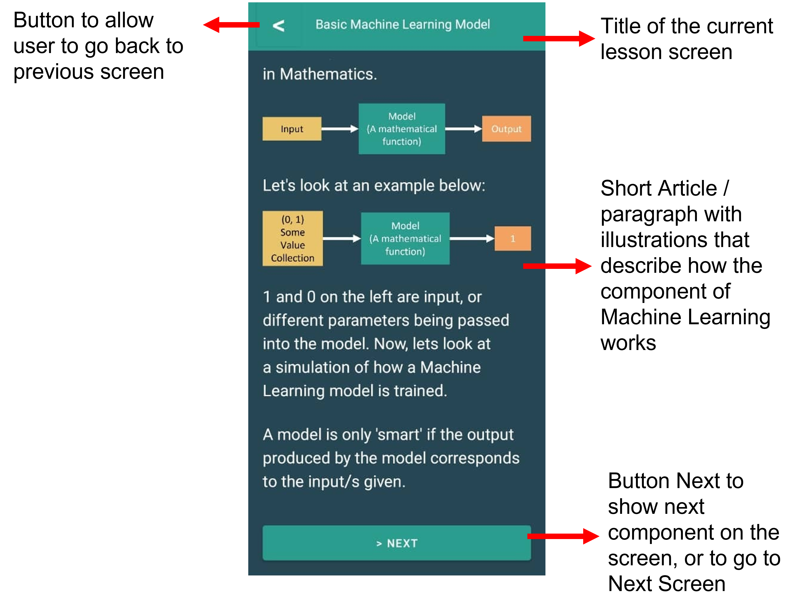

# Uncover ML
This app is developed using Android Studio. Attached below are some of the screenshots of use cases when using the app.

## Screenshots of the App
### Home Screen Lesson

### Home Screen Lesson

### Splash Screen

## Screenshot of Use Cases
### Use Case 1: Visualize different component for Machine Learning
  
Part 1: Visualizations of Component of Machine Learning
  

  

  

  

  

 
 
2. Simulation of Component of Machine Learning
 

  

 
 

### Use Case 2: Login to Store Progress

  

 

### Use Case 3: View short articles, with illustrations for component of Machine Learning

